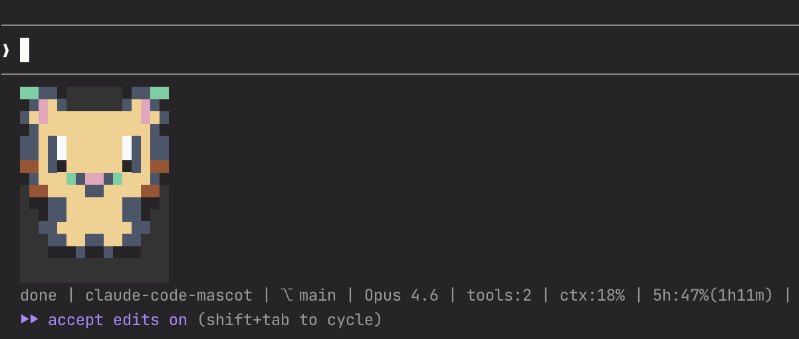

# Claude Code Mascot

A pixel-sprite mascot that lives in your Claude Code status line.

[日本語版はこちら / Japanese](README.ja.md)



## Features

- **Pixel-art mascot** rendered directly in the terminal — not ASCII art
- **Reacts to 9 session states**: idle, thinking, tool running, tool success, tool failure, permission prompt, subagent running, done, and auth success
- **Heat-map color shift**: the mascot's fur color shifts toward red as context window usage increases
- **Status summary**: git branch, model name, tool count, context %, and API usage
- **Custom mascot packs**: create and share your own characters

## Quick Start

### Via Claude Code Plugin Marketplace (Recommended)

```
/plugin marketplace add TeXmeijin/claude-code-mascot
/plugin install claude-code-mascot
```

Then run the setup skill to configure your status line and hooks:

```
/claude-mascot:setup
```

### Manual Install

```bash
git clone https://github.com/TeXmeijin/claude-code-mascot.git
cd claude-code-mascot
npm install && npm run build
node dist/cli/setup-helper.js --write
```

If `statusLine` already exists in your settings, add `--force` to replace it. Hook entries are merged without removing your existing hooks.

## Custom Packs

The mascot is fully swappable. You can create your own character pack and use it instead of the default cat.

### Pack search order

1. **Project-local**: `<project>/.claude/mascot-packs/<pack-name>/`
2. **User-global**: `~/.claude/plugins/claude-code-mascot/packs/<pack-name>/`
3. **Bundled**: `packs/<pack-name>/` (ships with the plugin)

### Creating a custom pack

1. Copy `examples/external-pack/pack.yaml` as a starting point
2. Place your pack in `~/.claude-mascot/packs/<your-pack-name>/pack.json` (or `pack.yaml`)
3. Set the pack name in `~/.claude/plugins/claude-code-mascot/config.json`:

```json
{
  "pack": "your-pack-name"
}
```

4. Validate your pack:

```bash
claude-mascot-validate-pack ~/.claude-mascot/packs/your-pack-name
```

5. Preview it:

```bash
claude-mascot-storybook --pack your-pack-name
```

See [docs/pack-spec.md](docs/pack-spec.md) for the full pack specification.

## Configuration

### Config files

- **User config**: `~/.claude/plugins/claude-code-mascot/config.json`
- **Project config**: `.claude/mascot.json` (overrides user config)

```json
{
  "pack": "pixel-buddy",
  "color": "auto",
  "twoLine": true,
  "renderProfile": "claude-code-safe",
  "safeBackground": "#000000"
}
```

### Environment variables

| Variable | Description |
|---|---|
| `CLAUDE_MASCOT_PACK` | Override the active pack name |
| `CLAUDE_MASCOT_COLOR` | Set to `never` to disable colors |
| `CLAUDE_MASCOT_WIDTH_HINT` | Hint the available width for narrow mode |
| `NO_COLOR` | Standard no-color flag (disables ANSI colors) |

### Render profiles

- `claude-code-safe` (default): keeps `half-block` rendering for visible pixels, emits transparent cells as background-colored non-breaking spaces to prevent host trimming
- `auto`: uses the pack's declared renderer exactly as-is

## CLI Tools

```bash
# Storybook-style gallery of all states
claude-mascot-storybook --pack pixel-buddy

# Preview a specific state
claude-mascot-preview-pack --pack pixel-buddy --state thinking --frames 3 --color always

# Validate a pack
claude-mascot-validate-pack ./packs/pixel-buddy

# Compare render profiles
claude-mascot-statusline-lab --pack pixel-buddy --profiles auto,claude-code-safe

# Render status line manually
printf '{"session_id":"demo","workspace":{"project_dir":"%s","current_dir":"%s"}}' "$PWD" "$PWD" | claude-mascot-statusline
```

## Development

```bash
git clone https://github.com/TeXmeijin/claude-code-mascot.git
cd claude-code-mascot
pnpm install
pnpm build
pnpm test
pnpm typecheck
```

## Uninstall

1. Remove or replace the `statusLine` entry in `~/.claude/settings.json`
2. Remove the mascot hook entries from `~/.claude/settings.json`
3. Optionally remove `~/.claude/plugins/claude-code-mascot/` to clear cached state and user packs

## License

[MIT](LICENSE)
