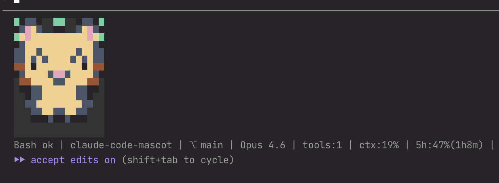
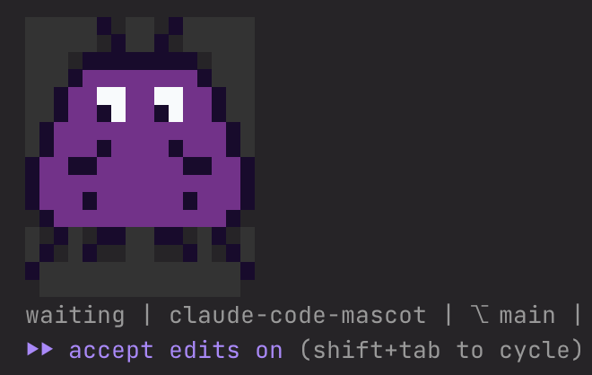

# Claude Code Mascot

A pixel-sprite mascot that lives in your Claude Code status line.

[日本語版はこちら / Japanese](README.ja.md)





## Concept

Claude Code has dramatically improved development efficiency — but it has also increased cognitive load. In the middle of intense coding sessions, we need a little moment of comfort.

This mascot changes its expression every time a tool runs during your session. When context window usage gets critical, it turns bright red in panic. You can even create your own custom character pack (this is still in beta — give it a try!).

For engineers who find themselves more and more consumed by their work — a small dose of comfort, right in your terminal.

## Personality

- **Pixel-art mascot** rendered directly in the terminal — not ASCII art
- **Reacts to 9 session states**: idle, thinking, tool running, tool success, tool failure, permission prompt, subagent running, done, and auth success
- **Heat-map color shift**: the mascot's fur color shifts toward red as context window usage increases
- **Status summary**: git branch, model name, tool count, context %, and API usage
- **Custom mascot packs**: create and share your own characters

## How It Works

The mascot detects session state through Claude Code's [hook system](https://docs.anthropic.com/en/docs/claude-code/hooks). Each hook event (tool start, tool success, permission request, etc.) updates the mascot's internal state, and the status line renders the corresponding expression.

Because this is event-driven rather than continuous polling, the displayed state may not always reflect the exact real-time status of your session. For example, there can be brief delays or missed transitions depending on hook timing. Think of it as a companion that reacts to events — not a precise status monitor.

## Bring One Home

### Via Claude Code Plugin Marketplace (Recommended)

```
/plugin marketplace add TeXmeijin/claude-code-mascot
/plugin install claude-code-mascot
```

Then run the setup skill to configure your status line and hooks:

```
/claude-mascot:setup
```

### Manual Install

```bash
git clone https://github.com/TeXmeijin/claude-code-mascot.git
cd claude-code-mascot
npm install && npm run build
node dist/cli/setup-helper.js --write
```

Existing `statusLine` is replaced automatically. Hook entries are merged without removing your existing hooks.

> A second built-in pack **space-invader** is also available — useful for distinguishing between projects or accounts.
>
> 

## Create Your Own Companion

The mascot is fully swappable. You can create your own character pack and use it instead of the default cat.

### Pack search order

1. **Project-local**: `<project>/.claude/mascot-packs/<pack-name>/`
2. **User-global**: `~/.claude/plugins/claude-code-mascot/packs/<pack-name>/`
3. **Bundled**: `packs/<pack-name>/` (ships with the plugin)

### Creating a custom pack

1. Copy `examples/external-pack/pack.yaml` as a starting point
2. Place your pack in `~/.claude-mascot/packs/<your-pack-name>/pack.json` (or `pack.yaml`)
3. Set the pack name in `~/.claude/plugins/claude-code-mascot/config.json`:

```json
{
  "pack": "your-pack-name"
}
```

4. Validate your pack:

```bash
node dist/cli/validate-pack.js ~/.claude/plugins/claude-code-mascot/packs/your-pack-name
```

5. Preview it:

```bash
node dist/cli/storybook.js --pack your-pack-name
```

See [docs/pack-spec.md](docs/pack-spec.md) for the full pack specification.

> **Tip:** You can also use the `/create-mascot-pack` skill in Claude Code to create or iterate on a pack interactively.

## Configuration

### Config files

- **User config**: `~/.claude/plugins/claude-code-mascot/config.json`
- **Project config**: `.claude/mascot.json` (overrides user config)

```json
{
  "pack": "pixel-buddy",
  "color": "auto",
  "twoLine": true,
  "renderProfile": "claude-code-safe",
  "safeBackground": "#000000"
}
```

### Environment variables

| Variable | Description |
|---|---|
| `CLAUDE_MASCOT_PACK` | Override the active pack name |
| `CLAUDE_MASCOT_COLOR` | Set to `never` to disable colors |
| `CLAUDE_MASCOT_WIDTH_HINT` | Hint the available width for narrow mode |
| `NO_COLOR` | Standard no-color flag (disables ANSI colors) |

### Render profiles

- `claude-code-safe` (default): keeps `half-block` rendering for visible pixels, emits transparent cells as background-colored non-breaking spaces to prevent host trimming
- `auto`: uses the pack's declared renderer exactly as-is

## CLI Tools

Run from the plugin root directory (`cd` into your clone or install path):

```bash
# View all states in a storybook-style gallery
node dist/cli/storybook.js --pack pixel-buddy

# Preview a specific state
node dist/cli/preview-pack.js --pack pixel-buddy --state thinking --frames 3 --color always

# Validate a pack file
node dist/cli/validate-pack.js ./packs/pixel-buddy

# Compare render profiles side by side
node dist/cli/statusline-lab.js --pack pixel-buddy --profiles auto,claude-code-safe

# Render status line manually (pipe JSON to stdin)
printf '{"session_id":"demo","workspace":{"project_dir":"%s","current_dir":"%s"}}' "$PWD" "$PWD" \
  | node dist/cli/render-status-line.js

# Run setup to write statusLine and hooks into settings.json
node dist/cli/setup-helper.js --write
```

## Development

```bash
git clone https://github.com/TeXmeijin/claude-code-mascot.git
cd claude-code-mascot
pnpm install
pnpm build
pnpm test
pnpm typecheck
```

## Contributing

- **Bug fixes**: If you find a clear bug, please open a pull request.
- **Custom mascots for yourself**: Create a custom pack locally — no need to upstream it.
- **New mascot packs for everyone**: If you've made something great, open a PR to add it as an additional built-in pack. We'd love to see it!
- **Creating packs with Claude Code**: Use the `/create-mascot-pack` skill to scaffold and iterate on new packs interactively.

## Good Bye

Run the uninstall command inside Claude Code:

```
/claude-code-mascot:uninstall
```

This removes the `statusLine` entry, all mascot hook entries from your settings, and the runtime data directory. Restart Claude Code to complete the removal.

## License

[MIT](LICENSE)
